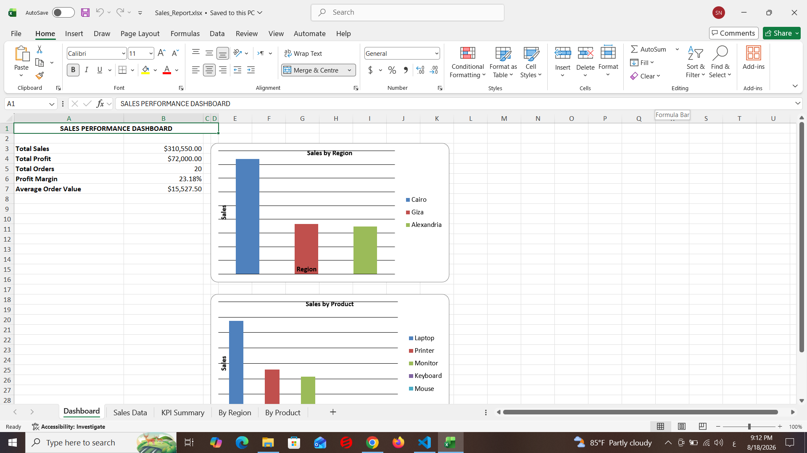
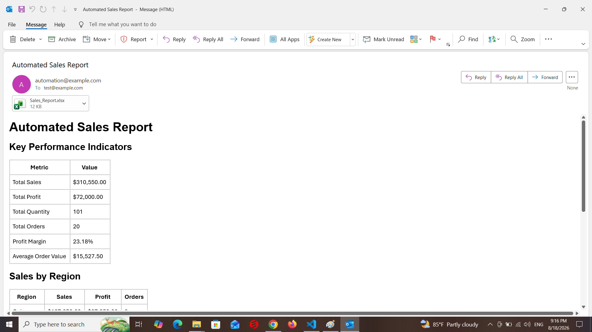
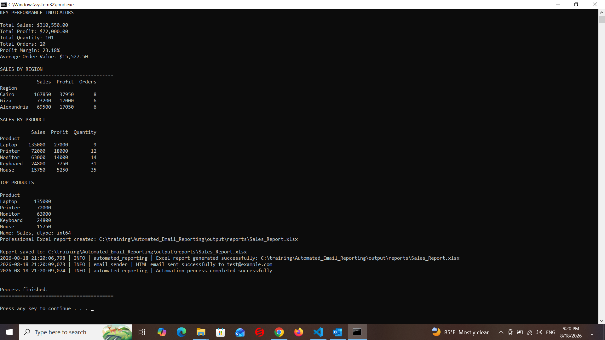
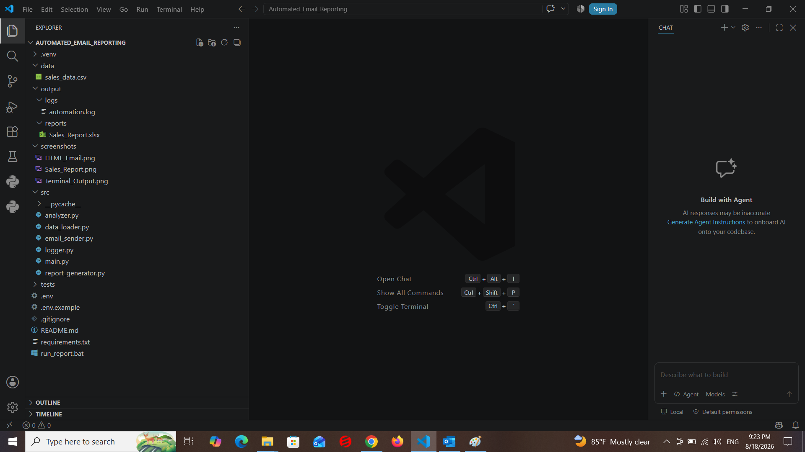

# Automated Email Reporting System

A Python-based automated reporting system that loads sales data, validates and analyzes it, generates a professional Excel report, and sends the report automatically by email.

## Project Overview

## Screenshots

### Excel Sales Report



### HTML Email Report



### Automation Execution



### Project Structure




This project automates the complete sales reporting workflow:

1. Load sales data from CSV.
2. Validate the data.
3. Calculate business KPIs.
4. Analyze sales by region.
5. Analyze sales by product.
6. Generate an Excel report.
7. Generate a professional HTML email.
8. Attach the Excel report to the email.
9. Send the report through SMTP.
10. Record application activity in log files.
11. Handle errors safely.
12. Run automatically using Windows Task Scheduler.

## Technologies

- Python
- Pandas
- OpenPyXL
- SMTP
- HTML Email
- python-dotenv
- Logging
- Windows Task Scheduler

## Project Structure

```text
Automated_Email_Reporting/
│
├── data/
│   └── sales.csv
│
├── output/
│   ├── reports/
│   │   └── Sales_Report.xlsx
│   └── logs/
│       └── automation.log
│
├── src/
│   ├── main.py
│   ├── data_loader.py
│   ├── analyzer.py
│   ├── report_generator.py
│   ├── email_sender.py
│   └── logger.py
│
├── tests/
│
├── .env
├── .gitignore
├── requirements.txt
├── README.md
└── run_report.bat


Features
Data Loading

The application loads sales data from CSV files using Pandas.

Data Validation

The system validates the input data before performing the analysis.

Validation includes:

Checking that the dataset is not empty
Checking required columns
Checking missing values
Validating the data before processing
KPI Analysis

The system calculates important business KPIs:

Total Sales
Total Profit
Total Quantity
Total Orders
Profit Margin
Average Order Value
Sales Analysis

The system generates:

Sales by Region
Sales by Product
Top Products
Excel Report

A professional Excel report is automatically generated.

Output:

output/reports/Sales_Report.xlsx

The report contains the analyzed sales information.

HTML Email

The system generates an HTML email containing:

KPI summary
Sales by Region
Sales by Product
Sales information
Excel Email Attachment

The generated Excel report is automatically attached to the email.

SMTP Email Sending

The application uses SMTP to send the report.

For development and testing, Mailtrap is used as the SMTP server.

Logging

The system records important events in:

output/logs/automation.log

Example:

INFO | automated_reporting | Automation process started.
INFO | automated_reporting | Sales data loaded successfully.
INFO | automated_reporting | Excel report generated successfully.
INFO | email_sender | HTML email sent successfully.
INFO | automated_reporting | Automation process completed successfully.
Error Handling

The application uses exception handling to safely handle unexpected errors.

Errors are recorded in the log file instead of failing silently.

Windows Task Scheduler

The application can run automatically using Windows Task Scheduler.

The scheduler executes:

run_report.bat

This allows reports to be generated and emailed automatically without manually running the Python application.

Technologies
Python
Pandas
OpenPyXL
python-dotenv
SMTP
HTML
Logging
Windows Task Scheduler
Mailtrap
Git
GitHub
Project Structure
Automated_Email_Reporting/
│
├── data/
│   └── sales.csv
│
├── output/
│   ├── reports/
│   │   └── Sales_Report.xlsx
│   │
│   └── logs/
│       └── automation.log
│
├── src/
│   ├── main.py
│   ├── data_loader.py
│   ├── analyzer.py
│   ├── report_generator.py
│   ├── email_sender.py
│   └── logger.py
│
├── tests/
│
├── .env.example
├── .gitignore
├── requirements.txt
├── README.md
└── run_report.bat
File Responsibilities
main.py

The main entry point of the application.

It controls the complete workflow:

Load
→ Validate
→ Analyze
→ Generate Report
→ Send Email
→ Log Result
data_loader.py

Responsible for:

Loading sales data
Validating the dataset
analyzer.py

Responsible for:

KPI calculations
Regional analysis
Product analysis
Top product analysis
report_generator.py

Responsible for generating the Excel report.

email_sender.py

Responsible for:

Creating the HTML email
Attaching the Excel report
Connecting to SMTP
Sending the email
logger.py

Responsible for application logging.

run_report.bat

Windows batch file used to run the automation.

Example Results

The current sample dataset produces the following KPIs:

Total Sales: $310,550.00
Total Profit: $72,000.00
Total Quantity: 101
Total Orders: 20
Profit Margin: 23.18%
Average Order Value: $15,527.50
Sales by Region
             Sales  Profit  Orders


Cairo       167850   37950       8
Giza         73200   17000       6
Alexandria   69500   17050       6
Sales by Product
           Sales  Profit  Quantity


Laptop    135000   27000         9
Printer    72000   18000        12
Monitor    63000   14000        14
Keyboard   24800    7750        31
Mouse      15750    5250        35
Installation
1. Clone the Repository
git clone https://github.com/samernsm/Automated_Email_Reporting.git

Enter the project directory:

cd Automated_Email_Reporting
2. Create Virtual Environment

On Windows:

python -m venv .venv

Activate the virtual environment:

.venv\Scripts\Activate.ps1
3. Install Dependencies
pip install -r requirements.txt
Configuration

The application uses environment variables for SMTP configuration.

Create a .env file in the project root:

Automated_Email_Reporting/
│
├── .env
├── src/
├── data/
└── README.md

Example:

SMTP_SERVER=sandbox.smtp.mailtrap.io
SMTP_PORT=587
SMTP_USERNAME=YOUR_MAILTRAP_USERNAME
SMTP_PASSWORD=YOUR_MAILTRAP_PASSWORD
EMAIL_SENDER=automation@example.com
EMAIL_RECEIVER=test@example.com

Replace:

YOUR_MAILTRAP_USERNAME

and:

YOUR_MAILTRAP_PASSWORD

with your Mailtrap SMTP credentials.

Security

Sensitive credentials must never be committed to GitHub.

The .env file is excluded through .gitignore.

.env

A safe example configuration is provided as:

.env.example

Example:

SMTP_SERVER=sandbox.smtp.mailtrap.io
SMTP_PORT=587
SMTP_USERNAME=YOUR_MAILTRAP_USERNAME
SMTP_PASSWORD=YOUR_MAILTRAP_PASSWORD
EMAIL_SENDER=automation@example.com
EMAIL_RECEIVER=test@example.com

Never put real SMTP passwords in .env.example.

Running the Application
Run with Python

Activate the virtual environment:

.venv\Scripts\Activate.ps1

Run:

python src\main.py
Run Using Batch File

The project includes:

run_report.bat

Run it from PowerShell:

.\run_report.bat

The batch file:

Opens the project directory
Activates the virtual environment
Runs the Python application
Deactivates the virtual environment
Output

After running the application, the Excel report is generated in:

output/reports/Sales_Report.xlsx

Logs are stored in:

output/logs/automation.log
Email Workflow

The email contains:

Automated Sales Report


Key Performance Indicators
--------------------------
Total Sales
Total Profit
Total Quantity
Total Orders
Profit Margin
Average Order Value


Sales by Region
---------------


Sales by Product
----------------


Excel Report Attachment
-----------------------
Sales_Report.xlsx
Mailtrap Testing

Mailtrap is used for development and testing.

The application sends the email through the Mailtrap SMTP server.

The message can then be viewed inside the Mailtrap Inbox without sending the test email to a real recipient.

This makes Mailtrap useful for safely testing email automation during development.

Windows Task Scheduler

The project can be automated using Windows Task Scheduler.

Task

Create a Windows Task Scheduler task such as:

Automated Sales Reporting
Action

Start:

C:\training\Automated_Email_Reporting\run_report.bat

The task can be configured to run:

Daily
Weekly
At a specific time
On a custom schedule

The scheduler automatically executes the reporting pipeline.

Error Handling

The main application is protected using exception handling.

If an error occurs, the system records the error in:

output/logs/automation.log

Example:

ERROR | automated_reporting | Automation process failed.

This makes troubleshooting easier and prevents silent failures.

Example Automation Flow
Windows Task Scheduler
          ↓
run_report.bat
          ↓
Python Application
          ↓
Load CSV
          ↓
Validate Data
          ↓
Calculate KPIs
          ↓
Analyze Regions
          ↓
Analyze Products
          ↓
Generate Excel Report
          ↓
Generate HTML Email
          ↓
Attach Excel Report
          ↓
Connect to SMTP
          ↓
Send Email
          ↓
Write Log
Future Improvements

Possible future improvements include:

Add Excel charts
Add monthly sales trends
Add sales dashboard
Add database support
Add automated retry for failed emails
Add email delivery status tracking
Add unit tests
Add configuration management
Add multiple report recipients
Add scheduled report periods
Add PDF report generation
Add cloud deployment
Add Docker support
Add CI/CD with GitHub Actions
Testing

The project includes a tests directory for automated tests.

Future tests can cover:

Data loading
Data validation
KPI calculations
Sales calculations
Excel report generation
Email generation
Error handling
Security Considerations

The project follows basic security practices:

SMTP credentials are stored in environment variables.
.env is excluded from Git.
Real passwords are never stored in source code.
.env.example contains only placeholder values.
Mailtrap is used for email testing.
Author

Samer Nabil

Python Developer | Data Analyst | Automation Developer

Project Purpose

This project demonstrates practical Python automation skills including:

Data processing
Business analysis
Excel automation
Email automation
SMTP integration
HTML email generation
Logging
Error handling
Windows automation
Task scheduling

It is designed as a portfolio project demonstrating the ability to build an end-to-end automated reporting solution.


### very important point


hn project i use:


```text
.env.example


.env

dont upload .env , i update .env.example


in GitHub after colne:

use
.env 
not 
.env.example

 